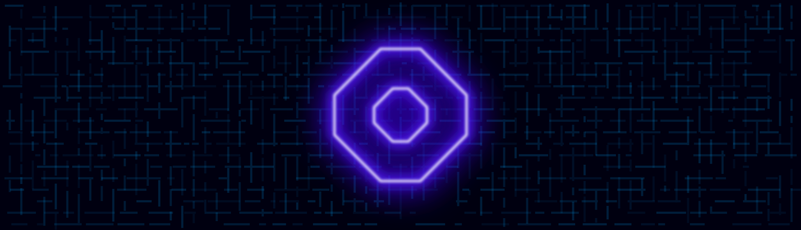

<p align="center">
	
	<br/>
	<span>Oxia is a static website build tool.</span>
	<br/><br/>
</p>

## Install
With npm
```bash
npm create oxia@latest
```
With pnpm
```bash
pnpm create oxia
```
With yarn
```bash
yarn create oxia
```

# Differences from JSX

## JSX expressions may return more than one element
No ```<></>``` (fragment) is required.

``` tsx
function Component() {
	return (
		<div></div>
		<div></div>
	)
}
```
``` tsx
function Component() {
	return <div></div><div></div>
}
```

## Style tags in JSX code
Style tags in JSX code do not require to be template literals - no `{``}` is required and CSS completions are available. Further, you can use navigable TypeScript code in style tags (see below). Please note, that the CSS code of style tags in JSX code gets inlined and is **not scoped**.
```tsx
function Component() {
	return (
		<div>
			<style>
				div {
					color: red;
				}
				div::after {
					content: "{`Value ${rand()}`}";
					background: {`${randomColor()}`};
				}
			</style>
		</div>
	)
}
```

# Example Files

index.oxia
```tsx
export default function index() {
	return <div>Hello, world!</div>
}
```

Component.oxia
```tsx
export default function Component() {
	return <div>Component</div>
}
```

index.oxia
```tsx
export default function index() {
	return <Component></Component>
}

function Component() {
	return <div>Component</div>
}
```

index.oxia
```tsx
export default function index() {
	return <Component></Component>
}

function Component() {
	return (
		<div>Component</div>
		<NestedComponent></NestedComponent>
	)

	function NestedComponent() {
		return <div>NestedComponent</div>
	}
}
```

# Styling

`<style>` tags may be placed
- at the module level - before and after function definitions
- at the function level - before and after the return statement

index.oxia
```tsx
// Module level
<style></style>

export default function index() {
	// Function level
	<style></style>

	return <Component></Component>

	// Function level
	<style></style>
}

// Module level
<style></style>

function Component() {
	// Function level (Component)
	<style></style>

	return (
		<div>Component</div>
		<NestedComponent></NestedComponent>
	)

	// Function level (Component)
	<style></style>

	function NestedComponent() {
		// Function level (NestedComponent)
		<style></style>

		return <div>NestedComponent</div>

		// Function level (NestedComponent)
		<style></style>
	}

	// Function level (Component)
	<style></style>
}

// Module level
<style></style>
```


## Style Scopes
Styles in Oxia are scoped.

- Styles in one module (file) **do not** affect other modules
- Styles in one component (function) **do not** affect other components
- Styles at the module level **do** affect components in the same module that do not have a `<style>` tag
- Styles at the component level **do** affect nested components that do not have a `<style>` tag

```tsx
export default function index() {
	<style></style> // Affects index only
	return <div></div>
}

function Component() {
	<style></style> // Affects Component only
	return <div></div>

	function InnerComponent() {
		<style></style> // Affects InnerComponent only
		return <div></div>
	}
}
```

```tsx
// Module level
<style></style>

export default function index() {
	return <div></div> // Affected by the module level style
}

function Component() {
	return <div></div> // Affected by the module level style

	function InnerComponent() {
		return <div></div> // Affected by the module level style
	}
}
```

```tsx
// Module level
<style></style>

export default function index() {
	<style></style>
	return <div></div> // Not affected by the module level style
}

function Component() {
	<style></style>
	return <div></div> // Not affected by the module level style

	function InnerComponentA() {
		return <div></div> // Affected by the component level style
	}

	function InnerComponentB() {
		<style></style>
		return <div></div> // Not affected by the component level style
	}
}
```

## Style Scope Hierarchy
The style scope hierarchy is determined solely from the module and function hierarchy, not from the resulting DOM structure. For example, nesting *function* `Child` in *function* `Parent` may change the style of the rendered `Child` component, but nesting *component* `Child` in *component* `Parent` does not change the style of the rendered `Child` component.

```tsx
export default function index() {
	return <Parent></Parent> // Renders 'Child' with a red border because...
}

function Parent() {
	<style>
	div {
		border: 1px solid red;
	}
	</style>

	return <Child></Child>

	function Child() {
		return <div>Child</div> // ...the Child function is nested in the Parent function
	}
}
```

```tsx
export default function index() {
	return <Parent></Parent> // Renders 'Child' without the red border because...
}

function Parent() {
	<style>
	div {
		border: 1px solid red;
	}
	</style>

	return <Child></Child>
}

function Child() {
	return <div>Child</div> // ...the Child function is not nested in the Parent function
}
```
However, to "shield" the nested Child function from it's Parent, we can create a boundary like this:
```tsx
export default function index() {
	return <Parent></Parent> // Renders 'Child' without a red border because...
}

function Parent() {
	<style>
	div {
		border: 1px solid red;
	}
	</style>

	return <Child></Child>

	function Child() {
		return <div>Child</div> // ...the Child function creates a boundary with this style tag:
		<style></style>
	}
}
```


## Global Styles
Use the `global` attribute to create global styles. Note that this only applies to styles at the module level - function level styles with `global` are silently ignored.

```html
<style global> ... </style>
```


## Styling Slotted Content
Use the `slot` attribute to style slotted components:
```html
<style slot="slot-name"> ... </style>
```

To style components in the default slot, the slot-name can either be omitted, empty or "default":
```html
<style slot></style>
<style slot=""></style>
<style slot="default"></style>
```


This feature is useful if you want to change the style of a component depending on the DOM hierarchy. For example, buttons with rounded edges may not look appealing when added to a button group where the buttons are arranged side by side. In this case, it would be nice if the button group had a way to style it's content:

Button.oxia
```tsx
export default function Button() {
	return <button>Button</button>
	// Standalone buttons will have this wonderful border:
	<style>
	button {
		border-radius: 8px;
		border: 2px solid red;
	}
	</style>
}
```

ButtonGroup.oxia
```tsx
export default function ButtonGroup() {
	return <div><slot/></div>

	<style>
	div {
		display: flex;
		width: fit-content;
		border: 2px solid blue;
	}
	</style>

	// This style removes the border from buttons in the "default" slot:
	<style slot>
	button {
		border: none;
		border-radius: 0;
	}
	</style>

	// To apply a style to content in a named slot:
	<style slot="foo">
	...
	</style>
}
```

index.oxia
```tsx
export default function index() {
	return <ButtonGroup><Button/><Button/><Button/></ButtonGroup>
}
```

# Slots
Oxia uses slots to place content into components.

To create a default slot, add a `<slot>` tag to the component:
```tsx
export default function Component() {
	return (
		<div>
			<slot />
		</div>
	)
}
```

To create a named slot:
```tsx
function Component() {
	return (
		<div>
			<slot name="foo" />
		</div>
	)
}
```

To place content into the component's default slot:
```tsx
export default function index() {
	return (
		<Component>
			<span>I am in the default slot</span>
			OR
			<span slot="default">I am in the default slot</span>
		</Component>
	)
}
```

To place content into a named slot:
```tsx
export default function index() {
	return (
		<Component>
			<span slot="foo">I am in the foo slot</span>
		</Component>
	)
}
```

To place multiple children into the same slot:
```tsx
export default function index() {
	return (
		<Component>
			<span slot="foo">I am in the foo slot</span>
			<span slot="foo">You are not alone here</span>
		</Component>
	)
}
```

A component can have multiple slots with the same name. This will place the slotted content into each of these slots:
```tsx
function Component() {
	return (
		<div>
			<slot name="foo" />
			<div>
				<slot name="foo" />
			</div>
			<slot name="foo" />
		</div>
	)
}

export default function index() {
	return (
		<Component>
			<span slot="foo">I am in all the foo slots</span>
		</Component>
	)
}
```

## Slot Drilling
Slot content can be transferred to slots of nested components:
```tsx
function Page() {
	return (
		<div>
			<PageHeader><slot name="logo" slot="logo" /></PageHeader>
			<PageFooter><slot name="logo" slot="logo" /></PageFooter>
		</div>
	)
}

function PageHeader() {
	return <div>Header logo: <slot name="logo" /></div>
}

function PageFooter() {
	return <div>Footer logo: <slot name="logo" /></div>
}

export default function index() {
	return (
		<Page></Page>
	)
}
```

## Slot Fallback Content
Slots can render fallback content if no content is slotted:
```tsx
function Component() {
	return (
		<slot name="empty"><div>This fallback will be rendered</div></slot>
		<slot name="filled"><div>This fallback will not be rendered</div></slot>
	)
}

export default function index() {
	return (
		<Component>
			<div slot="filled">This slot has content</div>
		</Component>
	)
}
```

## Conditional Rendering
Components can render their content depending on whether a slot is filled (`ifSlotFilled`) or empty (`ifSlotEmpty`):

```html
<slot name="the-slot-name"></slot>

<!-- This div only renders if slot "the-slot-name" is filled -->
<div ifSlotFilled="the-slot-name"></div>

<!-- This div only renders if slot "the-slot-name" is empty -->
<div ifSlotEmpty="the-slot-name"></div>
```

To address the default slot, the slot-name can either be omitted, empty or "default":
```html
<div ifSlotFilled></div>
<div ifSlotFilled=""></div>
<div ifSlotFilled="default"></div>
```

Example:
```tsx
function Component() {
	return (
		<slot name="empty"></slot>

		<div ifSlotFilled="empty">
			This div will not be rendered.
			<span>
				Nor will this span.
			</span>
		</div>

		<slot name="filled"></slot>

		<div ifSlotFilled="filled">
			...this div will be rendered.
			<span>
				And this span, too.
			</span>
		</div>
	)
}

export default function index() {
	return (
		<Component>
			<div slot="filled">This slot has content, therefore...</div>
		</Component>
	)
}
```

This can be used to toggle the display of single elements or whole element structures:
```tsx
function Component() {
	return (
		<div ifSlotFilled>
			<div>
				The slotted content
				<div>
					<slot name="default"></slot>
				</div>
			</div>
		</div>

		<span ifSlotEmpty>Just a span</span>
	)
}

export default function index() {
	return (
		<Component>
			<div>is so happy to be in these cosy divs!</div>
		</Component>
	)
}
```
